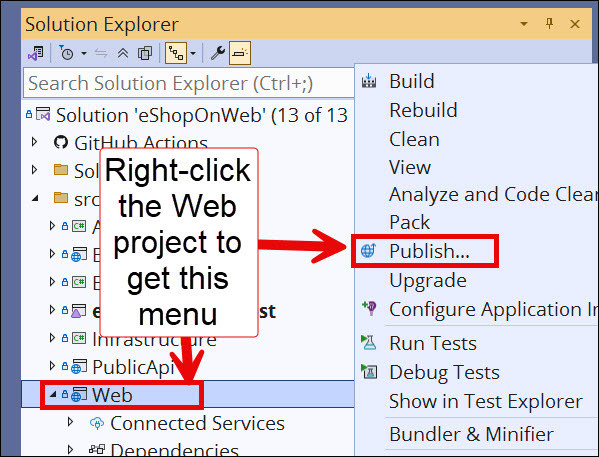
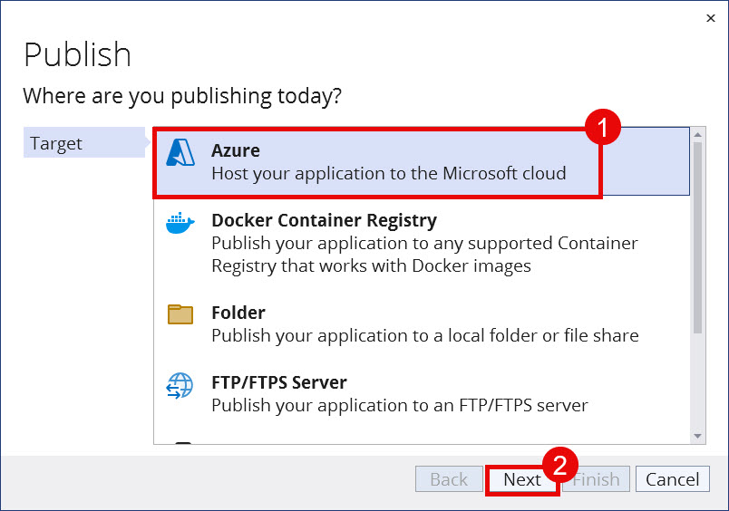
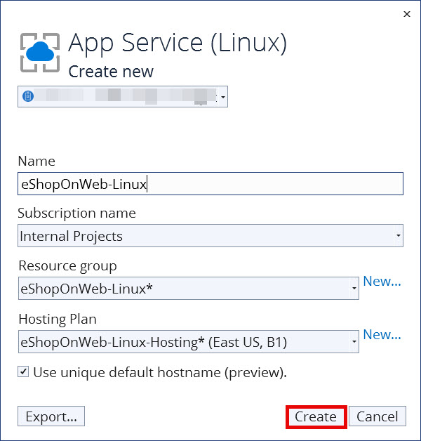
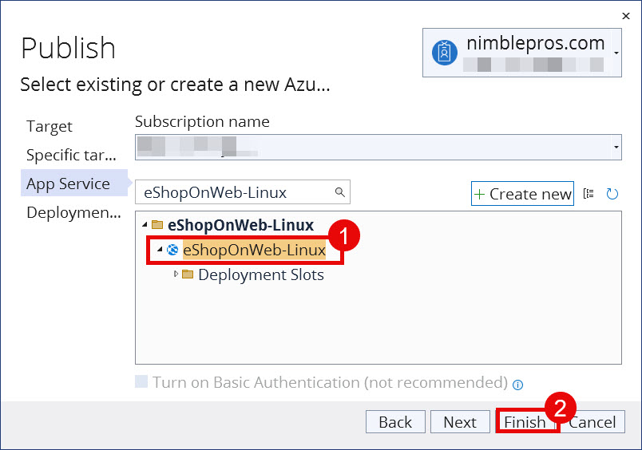

To deploy the eShopOnWeb sample application to an Azure App Service (assuming you've already cloned or downloaded it locally, and you [have an Azure account](https://azure.microsoft.com/en-us/free/)), follow these steps from Visual Studio ([see here to start from the Azure Portal]({{ site.baseurl }}/walkthroughs/deploy-to-azure-app-service-from-azure-portal)):

## 1. Open the eShopOnWeb solution in Visual Studio.

## 2. Right-click on the Web project in Solution Explorer and choose Publish.

## 3. From the Publish screen, select `+ New profile`

## 4. In the Publish dialog, select `Azure` as the target.

## 5. Select `Azure App Service (Linux)` for the Specific target.

## 6. Select the subscription and app service.

In the upper-right corner of the dialog, select your Microsoft account. Then, select your **Subscription name**. For this walkthrough, we'll create a new App Service, so select **+ Create new**.

## 7. Add the app services details.

On the **App Service (Linux)** dialog, make sure that the following details are correct:

- Microsoft account
- **Name** - This is for the App Service's name. This is unique for app services.
- **Subscription name**
- **Resource group** - If needed, create a new resource group.
- **Hosting Plan** - You can create a Linux hosting plan here.

If all looks well, then select **Create**. This will create the Azure resources.

## 8. Update Azure App Settings' Environment Variables

In order to populate the seed data, we need to set the `ASPNETCORE_ENVIRONMENT` variable to `Development`. (Note: This is not the same as `Debug` vs. `Release` configuration). The sample data is only seeded in the `Development` environment. You can configure the App Service to run in `Development` as follows:

1. In the Azure Portal, navigate to your Web App.

1. Select **Settings** > **Environment Variables**.

1. In the **App settings** section, add a new key `ASPNETCORE_ENVIRONMENT` with value `Development`.

1. Select **Apply**.

1. Add another key for `UseOnlyInMemoryDatabase` with the value of `true`.

1. Select **Apply**.

    

1. Finally, select **Apply** to apply all of these changes to the App Service.

## 9. Publish the app.

Once the Azure resources are created, the Publish dialog will appear for you to select an existing or new Azure resource. Select the new Azure App Service (Linux) that you created above. Then, select **Finish**.

The Publish profile will be saved.

You will then need to select the **Publish** button to publish the app to the App Service.

At this point, you should be able to refresh the site and see it loaded with data (if not, publish once more from Visual Studio).

[Learn more about Azure deployment options in the official documentation](https://docs.microsoft.com/en-us/azure/app-service-web/web-sites-deploy).

## Notes

- You may need to ensure you have the [Bundler and Minifier extension](https://docs.microsoft.com/en-us/aspnet/core/client-side/bundling-and-minification) installed in Visual Studio, otherwise your CSS may not be minified and referenced correctly in the deployed version of the application. Alternately, you can modify `_Layout.cshtml` to use app.css instead of `app.css.min` in Production.